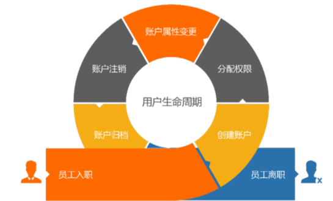
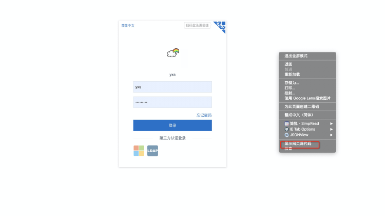
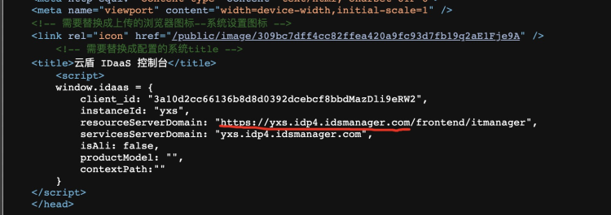
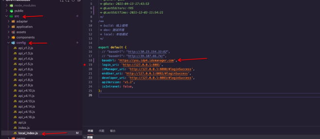
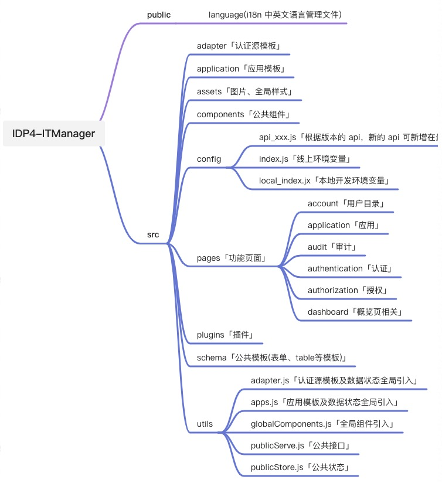
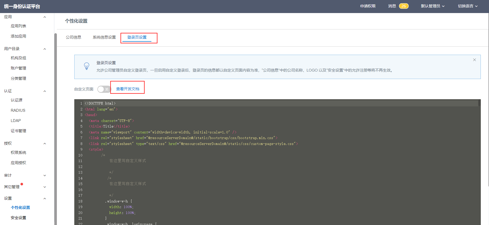

# IT管理员模块开发指南

> 维护人：前端团队   
> 适用版本：IDP4   
> 最后更新时间：2021.12.01

# 介绍
IDaaS 中有 5A 的概念，分别对应：应用（Application）、账户（Account）、认证（Authentication）、授权（Authorization）、审计（Audit)。
从而实现将各个业务系统中的组织机构和数据进行统一管理，被管理资源账号的创建、删除、启用/禁用及同步等流程的自动化管理，
实现账号的安全生命周期管理等。

# 准备开发
在开发之前，需要了解我们的项目结构以及所使用到的技术栈，那么先从最简单基础的开始吧~

首先我们需要安装开发工具及相关工具：

[vsCode]()「开发工具」   
[sourdeTree](https://www.sourcetreeapp.com/)「分支管理工具」

## 仓库地址
[https://codeup.aliyun.com/idaas_wb/WB-IDP-Frontend/IDP4-ITManager.git](https://codeup.aliyun.com/idaas_wb/WB-IDP-Frontend/IDP4-ITManager.git)

## 技术栈
了解项目使用的技术栈，上手更快哦

| 名称 | 文档地址 | 主要功能 |
| --- | --- | --- |
| Vue-Cli | [https://cli.vuejs.org/](https://cli.vuejs.org/) | 脚手架 |
| Vue | [https://cn.vuejs.org/](https://cn.vuejs.org/) | 前端框架 |
| Vuex | [https://vuex.vuejs.org/zh/](https://vuex.vuejs.org/zh/) | 前端框架 |
| iview | [https://iviewui.com/docs/introduce](https://iviewui.com/docs/introduce) | 前端框架 |
| axios | [http://www.axios-js.com/zh-cn/](http://www.axios-js.com/zh-cn/) | http库 |

## 环境&配置
只需要以下几个步骤，则可以将项目运行起来啦！

1.安装node和npm，可以使用nvm工具来安装和管理node版本：[nvm安装和使用教程](https://blog.csdn.net/qq_41866776/article/details/102664679)

2.安装vscode，打开项目，执行 `npm install ` 安装依赖

3.本地启动前，需要更改 `src/config/local_index.js` 文件中的配置，IT管理员模块只需要修改一个配置项：`baseUrl`  ，
一般在环境确定后，在网页上右键“显示网页源代码”，就可以看到相关的属性值，复制到本地即可：

4.拷贝“resourceServerDomain” 划线部分到 `src/config/local_index.js` 的 “baseUrl” 即可。

5.启动服务：`npm run serve`

6.打包：`npm run build`   打包后的目录为 dist

## 项目结构
现在，项目已经运行起来，我们则可以结合页面，来快速熟悉项目结构啦！

## 开发规范

请参考文档[《开发规范》](resources/阿里巴巴IDaaS前端开发规范.pdf)

## 开发场景
### 应用插件、认证源插件、短信插件表单定义

一般来说，java交付工程师在开发插件的时候就可以按照文档将表单配置页面的schema定义好，但有时可能模板库里的控件无法覆盖所有场景，这时候需要前端研发人员对模板库进行调整；模板文档请参考
[《schema模板》](https://github.com/aliyun-idaas/idp4-plugin-frontend-schema/tree/main/dist)

### 登录页定制

登录页定制根据项目具体情况，选择合适的定制方式，这里提供几种建议

1、定制内容少，只定制样式，不区分应用，使用IDaaS提供的登录地址 （个性化登录页）
登录管理员控制台》设置》个性化设置》登录页设置

2、只定制登录页样式，区分应用，每个应用页面不一样，使用应用原有登录地址 （登录插件）
具体基础文档请到IDaaS产品文档库搜索“自定义登录”

3、定制内容很多，除样式外，登录流程，二次认证流程等也有定制 （项目分支中定制Login模块）
登录模块开发请参考文档  [《用户登录模块开发指南》](./用户登录模块开发指南.md)

## 注意事项

1.不要随意升级 iview 组件库

2.项目太大，找不到文件？-> 在页面上复制提示文案，全局搜索，在语言翻译文件中查找文案，找到对应的 key，全局搜索 key，则可找到对应的文件啦！

