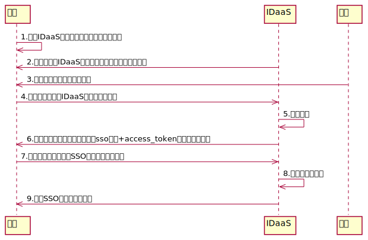
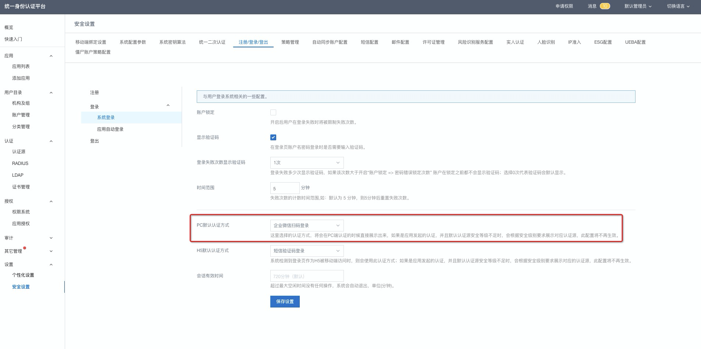
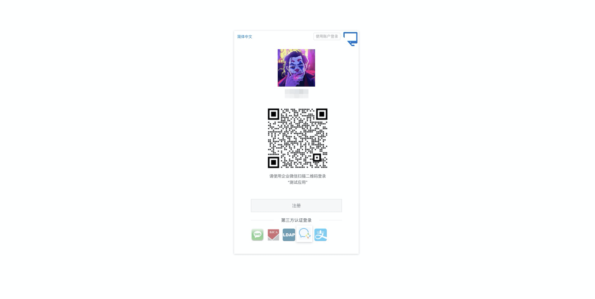
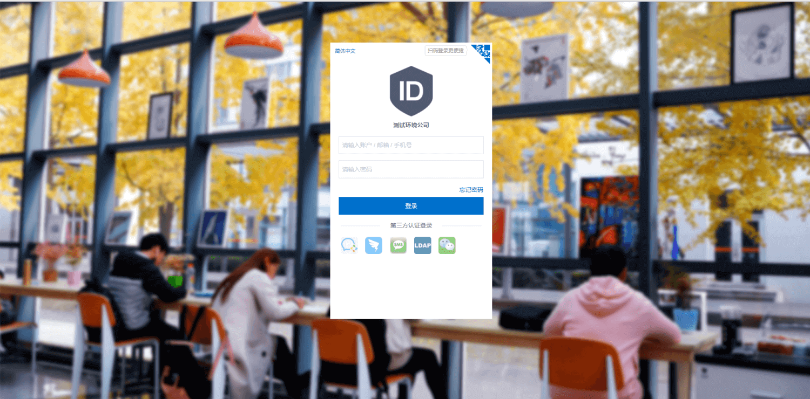
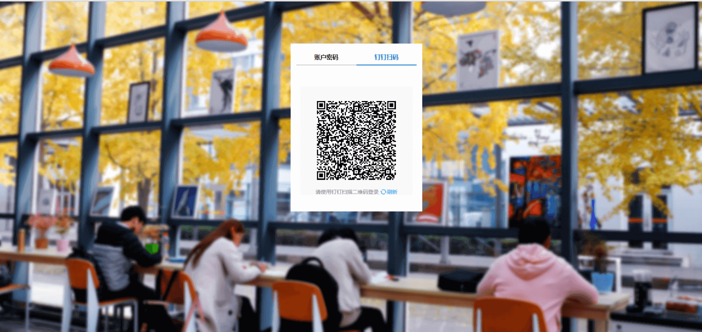
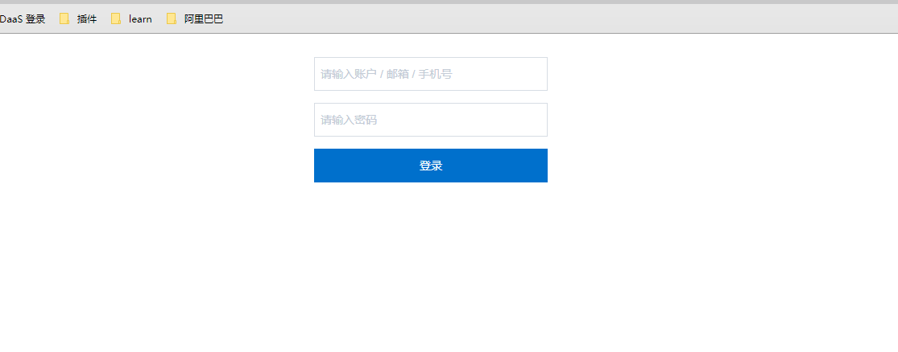
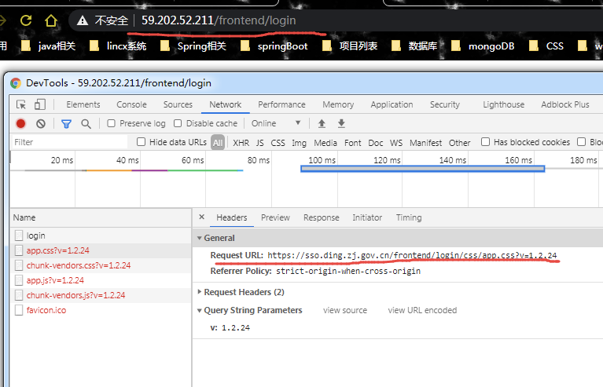

# IDaaS登录插件集成文档


# 简介

IDaaS 的登录插件可以将登录模块嵌入到应用的登录页，用户登录之后 IDaaS 直接登录应用中并保持登录会话，在访问其他与 IDaaS 集成过的应用时也无需再次登录。
<a name="NrEba"></a>

# 使用场景

1. 应用想使用 IDP 的账户登录认证，并且不想集成多种认证方式而可以复用 IDP 的认证方式来认证；
1. 应用集成了 SSO 情况下，想在自己的登录页上使用我们的认证能力；

​

<br />
<br />用户可选择已配置好的认证源进行认证源，认证源后进入应用系统。
<a name="WQVEg"></a>

# 前置条件

1、对接 IDaaS 单点登录 根据业务系统使用的协议不同选择不同的对接方式，这里提供一个参考文档「 [**应用开发** - **单点登录（SSO）** - **最佳实践**](../SP应用开发/单点登录SSO.html#jwt) 」<br />2、业务系统能够访问到 IDaaS 服务静态资源，才能在业务系统登录页引入插件脚本。
<a name="caZoj"></a>

# 集成步骤

<a name="HvOiq"></a>

## 引入脚本

IDaaS 提供的脚本默认地址为：`${servicesServerDomain}/frontend/login/static/js/idaas-login-plugin.js`<br />
在登录页中通过 `script` 标签引入即可，如下代码：

```java
<div class="container" id="container">
  <script src="${servicesServerDomain}/frontend/login/static/js/idaas-login-plugin.js"></script>
</div>
```

可以看到这里的示例并不是在 body 外引用，而是将 script 标签放在了一个 id 名为 container 的 div 中，这样做是有意义的，插件初始化时会根据配置的容器 id 找到对应的容器并在其中创建 iframe,如果没有配置，那么插件会默认在脚本引用的容器中进行创建，如示例中将在 id 名为 container 的 div 中创建 iframe 加载 IDaaS 认证方式。
<a name="eIGOt"></a>

## 插件初始化

在引入插件后需要在登录页初始化，以便将一些配置信息提供给插件，示例：

```html
<script>
	window.onload = function () {
		var idaasLogin = new IDaaSLoginPlugin({
			serverUrl: 'https://yongqi.idp4.idsmanager.com',
			portalUrl: 'https://yongqi.idp4.idsmanager.com/frontend/login#/login',
			instanceId: 'yongqi',
			appId: 'e1e5986b401ec5fa8c65a09d9e2b4a92qI11UDmWmjt',
			styleUrl: '',
			styleTxt:
				'.login-page .login-btn { background-color: yellow !important;}',
			// hideForgetPassword: true,
			// hideLogo: true,
			// hideEnterpriseName: true,
			// hideLanguage: true,
			minimalism: false,
			box: '',
			width: '320',
			height: '700',
			target: false,
		});
	};
	// 接收 SSO 地址进行跳转
	window.addEventListener('message', function (event) {
		typeof event.data.startUrl == 'string' &&
			event.data.startUrl != '' &&
			(window.location.href = event.data.startUrl);
	});
</script>
```

> 注：以上参数为示例，使用时根据实际应用参数为准。

<a name="IerOi"></a>

## 参数说明

| 名称               | 类型    | 是否必须 | 描述                                                                                                                                                                                                                                                                                                                                                                                   |
| ------------------ | ------- | -------- | -------------------------------------------------------------------------------------------------------------------------------------------------------------------------------------------------------------------------------------------------------------------------------------------------------------------------------------------------------------------------------------- |
| serverUrl          | String  | 是       | IDaaS 服务地址                                                                                                                                                                                                                                                                                                                                                                         |
| portalUrl          | String  | 是       | IDaaS 登录模块地址                                                                                                                                                                                                                                                                                                                                                                     |
| instanceId         | String  | 是       | 租户 ID                                                                                                                                                                                                                                                                                                                                                                                |
| appId              | String  | 是       | 登录后默认进入应用的 applicationUuid，在 IDaaS 应用列表操作栏“详情”中可查看                                                                                                                                                                                                                                                                                                            |
| box                | String  | 否       | 放置登录框位置 dom ID，默认在脚本处初始化                                                                                                                                                                                                                                                                                                                                              |
| width              | Number  | 否       | 嵌入的登录模块宽度                                                                                                                                                                                                                                                                                                                                                                     |
| height             | Number  | 否       | 嵌入的登录模块高度                                                                                                                                                                                                                                                                                                                                                                     |
| target             | Boolean | 是       | 登录之后是否 SSO 跳转到应用，默认为 true<br />如果不想自动跳转或自动跳转失败可设为 false，但必须配合监听事件来完成手动跳转。<br />监听事件示例：<br />// startUrl: 登录后的 SSO 跳转地址 <br />window.addEventListener("message", function(event) {<br />typeof event.data.startUrl == 'string' && event.data.startUrl != '' && (window.location.href = event.data.startUrl);<br />}); |
| styleUrl           | String  | 否       | 外部样式链接，修改登录模块样式的 css 文件地址                                                                                                                                                                                                                                                                                                                                          |
| styleTxt           | String  | 否       | 内嵌样式，通过 css 修改登录模块样式                                                                                                                                                                                                                                                                                                                                                    |
| hideForgetPassword | Boolean | 否       | 是否隐藏忘记密码入口                                                                                                                                                                                                                                                                                                                                                                   |
| hideLogo           | Boolean | 否       | 是否隐藏公司 logo                                                                                                                                                                                                                                                                                                                                                                      |
| hideEnterpriseName | Boolean | 否       | 是否隐藏公司名称                                                                                                                                                                                                                                                                                                                                                                       |
| hideLanguage       | Boolean | 否       | 是否隐藏语言切换入口                                                                                                                                                                                                                                                                                                                                                                   |
| minimalism         | Boolean | 否       | 是否为极简模式，极简模式下只显示登录框内容部分，其余部分又集成方自定义。                                                                                                                                                                                                                                                                                                               |

<a name="R9WZ9"></a>

## 切换认证方式

1. 默认认证方式切换<br />本系统默认的认证方式为账密认证，在使用过程中，如果您想换用别的认证方式（比如企业微信扫码登录）可在系统配置中进行设置。操作路径为：【设置】-【安全设置】-【注册/登录/登出】，选择【登录】-【系统登录】进入到配置页面，在「PC 默认认证方式」配置项中选中“企业微信扫码登录"，然后点击【保存设置】即可。<br /><br />配置成功后，登录页面下图（示例图片中的样式您可以进行自定义设置）：<br /><br />2、通过调用登录插件提供的方法进行认证方式切换，适用于极简模式下集成方自定义切换按钮

```javascript
idaasLogin.changeLoginType(type);
```

type 可以为：<br />1、认证源的 **`enterpriseAuthId`** (认证源切换，包含插件与非插件认证源，在 IDaaS 管理员控制台认证源列表处查看)<br />2、up/qr (默认登录方式用户名密码/云身份管家扫码登录切换)<br />注：切换的认证方式如果是 **`enterpriseAuthId`** ，则需要 IDaaS 配置了相应的认证源，并启用了才能实现，否则无法正常切换。
<a name="Xt750"></a>

## 登录方式切换监听

在集成方登录页，点击 idaas 某种登录方式时，如果想要获取到当前登录方式，可使用以下方式进行获取：

```javascript
window.addEventListener('message', function (event) {
	if (event.data.loginType && event.data.loginType == 'ddtalk') {
		//监听到是钉钉扫码方式可以做一些操作，比如隐藏三方登录模块
		idaasLogin.handleShowThirdLogin(false);
	} else if (event.data.loginType) {
		//监听到是其他登录方式就还原
		idaasLogin.handleShowThirdLogin(true);
	}
});
```

<a name="z65pG"></a>

## 自定义样式

登录插件支持通过外部引用和内嵌的方式来修改登录框元素的样式，外链为上文中的 **`styleUrl`** 参数，内嵌为上文中的 **`styleTxt`** 参数。
<a name="Rtgu2"></a>

### 内嵌方式

内嵌方式需要定义一个变量来写入 css 样式，如：

```javascript
var imStyleTxt = '#btnLogin,.login-page .btn-login { background-color: yellow;}';
```

再将 **`imStyleTxt`** 变量付给初始化参数中的 **`styleTxt`** 即可。
<a name="rrfX7"></a>

### 外链方式

在登录框外层 box 上存在 **`idaas-login-plugin`** 类名，通过它来索引子级元素对样式进行修改，如:

```css
// 修改title选中下边线颜色
.idaas-login-plugin .login-title .active {
	border-color: green;
}
// 修改账户输入框图标
.idaas-login-plugin .login-box .control-name .ivu-input-prefix {
	background: url(xxx) no-repeat;
}
.idaas-login-plugin .login-box .control-name .ivu-input-prefix i {
	display: none;
}
// 修改密码输入框图标
.idaas-login-plugin .login-box .control-password .ivu-input-prefix {
	background: url(xxx) no-repeat;
}
.idaas-login-plugin .login-box .control-password .ivu-input-prefix i {
	display: none;
}
// 隐藏找回密码入口
.idaas-login-plugin .login-box .forget-password {
	display: none;
}
// 修改登录按钮样式
.idaas-login-plugin .login-box .btn-login {
	background-color: green;
}
```

将 css 样式文件放在资源服务器上，将外链地址赋给初始化参数中的 **`styleUrl`** 即可。
<a name="bby7T"></a>

#### 注意事项

- 以上只是示例代码，通过浏览器 "开发者工具" 查看页面元素结构，在外链样式表中可进行更多的样式调整。
- 如果遇到外链跨域或者无法正常调取，请使用内嵌方式。
- 嵌入登录插件的外层盒子属性如有使用 **`display: none`** 属性，需要改为 **`visibility: hidden`** 的方式进行元素隐藏，否则系统因为检测不到当前登录框宽度，导致系统加载异常。

​<br />
<a name="Rh0lT"></a>

## 集成 Demo

请根据想要实现的效果下载对应 demo 附件，注意**需要修改 demo 中的系统参数为实际值**<br />标准集成效果（无自定义样式、自定义结构，使用标准 IDaaS 登录页）：<br /><br />自定义登录框 dom 结构集成效果：<br />
<a name="AZGWF"></a>

### 相关下载

[标准集成 Demo](https://github.com/aliyun-idaas/idp4-frontend-custom-login-demo)<br />
[自定义切换方式集成 Demo](https://github.com/aliyun-idaas/idp4-frontend-custom-login-demo)<br />

<a name="gWusm"></a>

# 常见问题

<a name="ZJuGh"></a>

##### Q:不想要使用 IDaaS 提供的全部认证方式，希望按照自己需求自行选择，如何实现？

A:插件提供极简模式，登录框只展示登录必须内容，集成者可通过调用插件提供的方法进行切换登录方式，极简模式效果：<br />
<br />

<a name="dZ12Y"></a>

##### Q:如何通过 access_token 获取应用列表

A:需要使用手动跳转模式，先配置 target 为 false,然后配合监听事件监听到插件返回的 url，url 中包含了 access_token ,集成方可将 access_token 截取出来使用，调用 idaas 提供的应用列表接口：/api/bff/v1.2/enduser/portal/sso/app_list（注意此接口需要集成方后端调用，否则会有跨域问题）
<a name="AbNgb"></a>

##### Q:业务系统如何退出 IDaaS？

A:请移步至[【**单点退出（SLO）**】-【**SP SLO**】-【**3.1 全局退出**】] 场景文档<br />

<a name="XL8Rj"></a>

##### Q:业务系统集成登录插件后跳转 404 怎么办？

A:检查插件集成 SSO 配置地址是否正确，确保业务系统在 idaas 中单点登录流程是通畅的。<br />

<a name="I1lL1"></a>

##### Q:业务系统集成登录插件，将 target 设置为 false,系统无法进入 js 监听事件？

A:js 监听事件最好与插件集成代码在同一个文件中

```js
  var idaasLogin = new IDaaSLoginPlugin({
   	...
    target: false,
    ...
  });
  window.addEventListener("message", function(event) {
    console.log(event)
    typeof event.data.startUrl == 'string' && event.data.startUrl != '' && (window.location.href = event.data.startUrl);
  });
```

<a name="Um3xH"></a>

##### Q:业务系统中集成插件报跨域问题？

A:集成过程中确保资源和插件引用都在同一个域下<br /><br />


