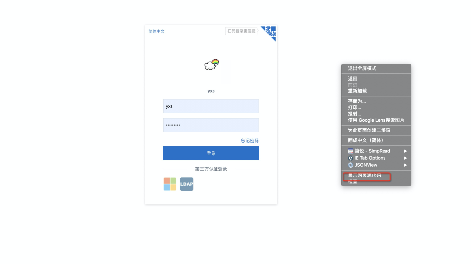
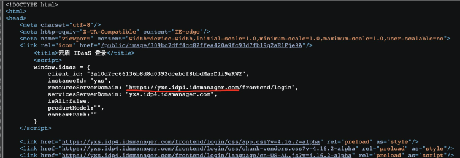
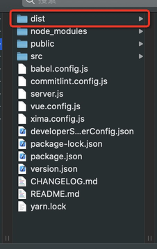
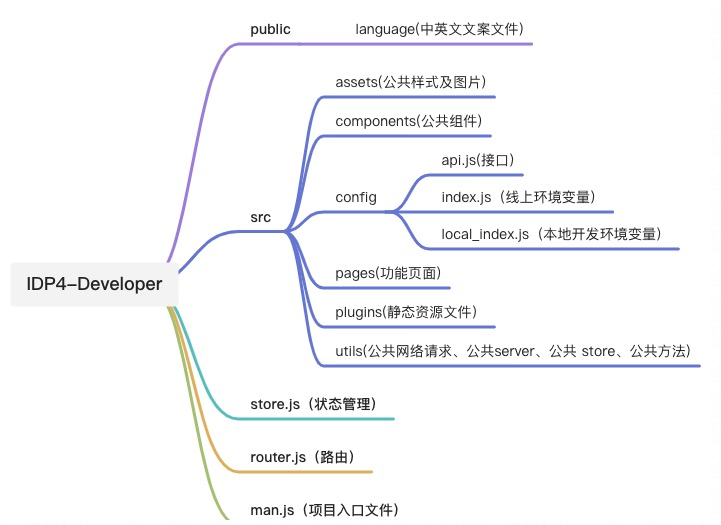

# 开发者模块开发指南

> 维护人：前端团队
> 适用版本：IDP4
> 最后更新时间：2021.11.30

## 背景
开发者模块主要功能为开发者接入 IDP4 的功能，及相关文档帮助开发者熟悉如何定制开发及 IDaas 开放能力等。

## 仓库地址
[https://codeup.aliyun.com/idaas_wb/WB-IDP-Frontend/IDP4-developer.git](https://codeup.aliyun.com/idaas_wb/WB-IDP-Frontend/IDP4-developer.git)

## 环境&工具
安装 node 和 npm

开发工具及相关工具：

[vsCode]()「开发工具」

[sourdeTree](https://www.sourcetreeapp.com/)「分支管理工具」

## 主要技术与文档
| 名称 | 文档地址 | 主要功能 |
| --- | --- | --- |
| Vue-Cli | [https://cli.vuejs.org/](https://cli.vuejs.org/) | 脚手架 |
| Vue | [https://cn.vuejs.org/](https://cn.vuejs.org/) | 前端框架 |
| Vuex | [https://vuex.vuejs.org/zh/](https://vuex.vuejs.org/zh/) | 前端框架 |
| iview | [https://iviewui.com/docs/introduce](https://iviewui.com/docs/introduce) | 前端框架 |
| axios | [http://www.axios-js.com/zh-cn/](http://www.axios-js.com/zh-cn/) | http库 |

## 运行项目

1.安装node和npm，可以使用nvm工具来安装和管理node版本：[nvm安装和使用教程](https://blog.csdn.net/qq_41866776/article/details/102664679)

2.安装依赖：`npm install`

3.本地开发时，需要更改 `src/config/local_index.js` 文件中的配置项，开发者模块只需要更改 “baseUrl” 即可。在确认环境后，右键“显示源代码”即可查看 “baseUrl”。如下图：

4.拷贝“resourceServerDomain” 划线部分到 `src/config/local_index.js` 的 “baseUrl” 即可。

5.运行：`npm run serve`

6.打包：`npm run build`

打包后的文件为 `dist`。

## 项目结构

## 开发规范
请参考文档[《开发规范》](resources/阿里巴巴IDaaS前端开发规范.pdf)。

## 注意事项
1、不要轻易升级 iview 组件库
​

​

