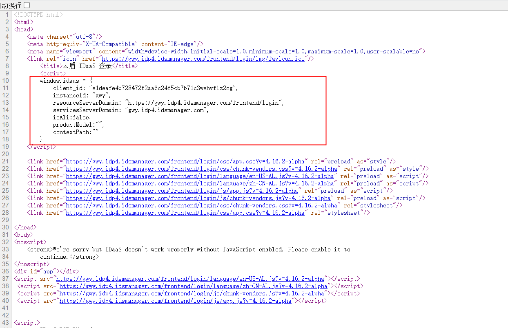
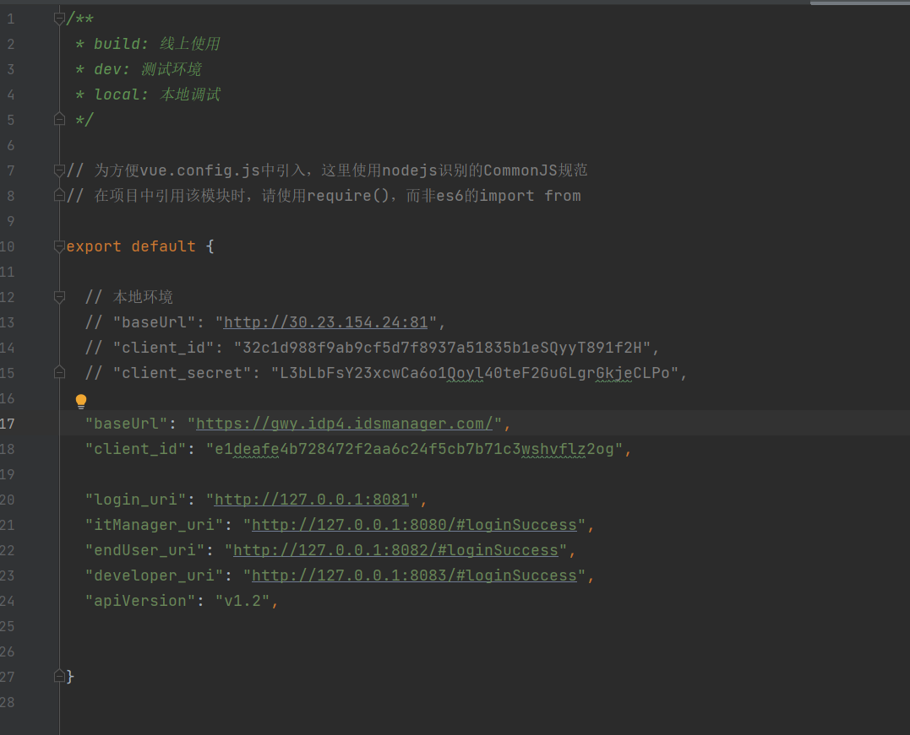
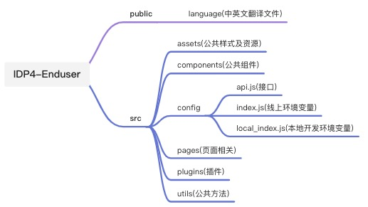

# 普通用户门户模块开发指南

> 维护人：前端团队   
> 适用版本：IDP4   
> 最后更新时间：2021.12.01

# 介绍
IDP4前端普通用户模块，主要包含单点登录，修改账户邮箱、手机号、密码，查看账户日志等功能。

# 准备
### 1.仓库地址
[https://codeup.aliyun.com/idaas_wb/WB-IDP-Frontend/IDP4-Enduser.git](https://codeup.aliyun.com/idaas_wb/WB-IDP-Frontend/IDP4-Enduser.git)
​

### 2.环境和配置
（1）安装node和npm，可以使用nvm工具来安装和管理node版本：[nvm安装和使用教程](https://blog.csdn.net/qq_41866776/article/details/102664679)

（2）安装vscode，打开项目，执行 `npm install ` 安装依赖

（3）本地启动前，需要更改 `src/config/local_index.js` 文件中的配置，用户模块一般只需要修改两个配置项：`baseUrl`  `client_id` ，一般在确定baseUrl以后，在网页上查看网页源代码，就可以看到相关的属性值，复制到本地即可：

（4）启动服务：`npm run serve`

（5）打包：`npm run build`   打包后的目录为 dist

### 3.项目结构

### 4.技术栈
| **名称** | **文档地址** | **描述** |
| --- | --- | --- |
| Vue-Cli | [https://cli.vuejs.org/](https://cli.vuejs.org/) | 脚手架 |
| Vue | [https://cn.vuejs.org/](https://cn.vuejs.org/) | 前端框架 |
| Vuex | [https://vuex.vuejs.org/zh/](https://vuex.vuejs.org/zh/) | 前端框架 |
| iview | [https://iviewui.com/docs/introduce](https://iviewui.com/docs/introduce) | 前端框架 |
| axios | [http://www.axios-js.com/zh-cn/](http://www.axios-js.com/zh-cn/) | http库 |

## 开发规范
请参考文档[《开发规范》](resources/阿里巴巴IDaaS前端开发规范.pdf)
  

