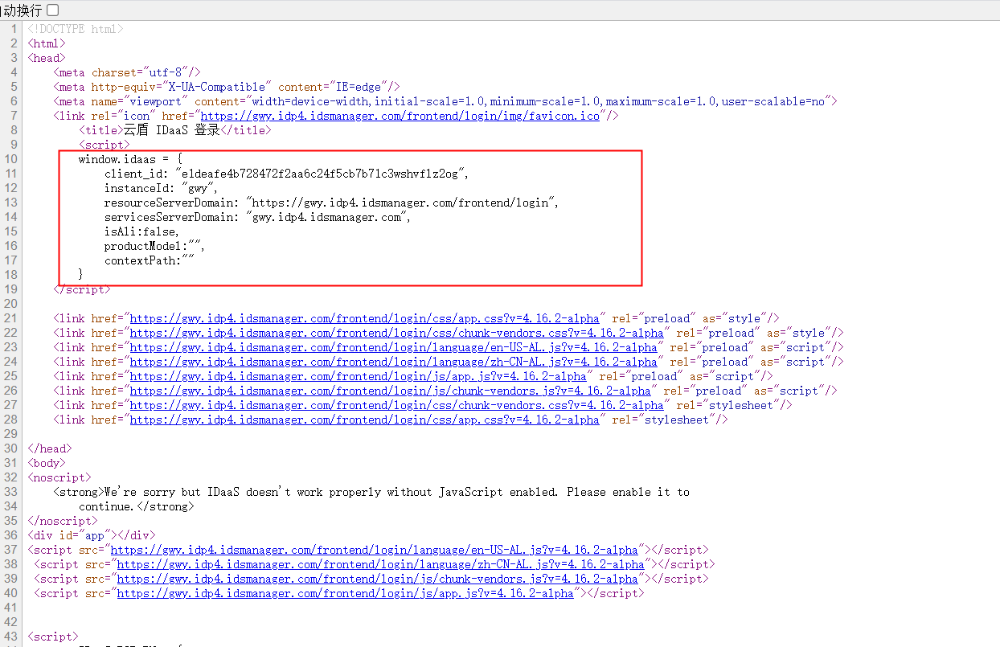
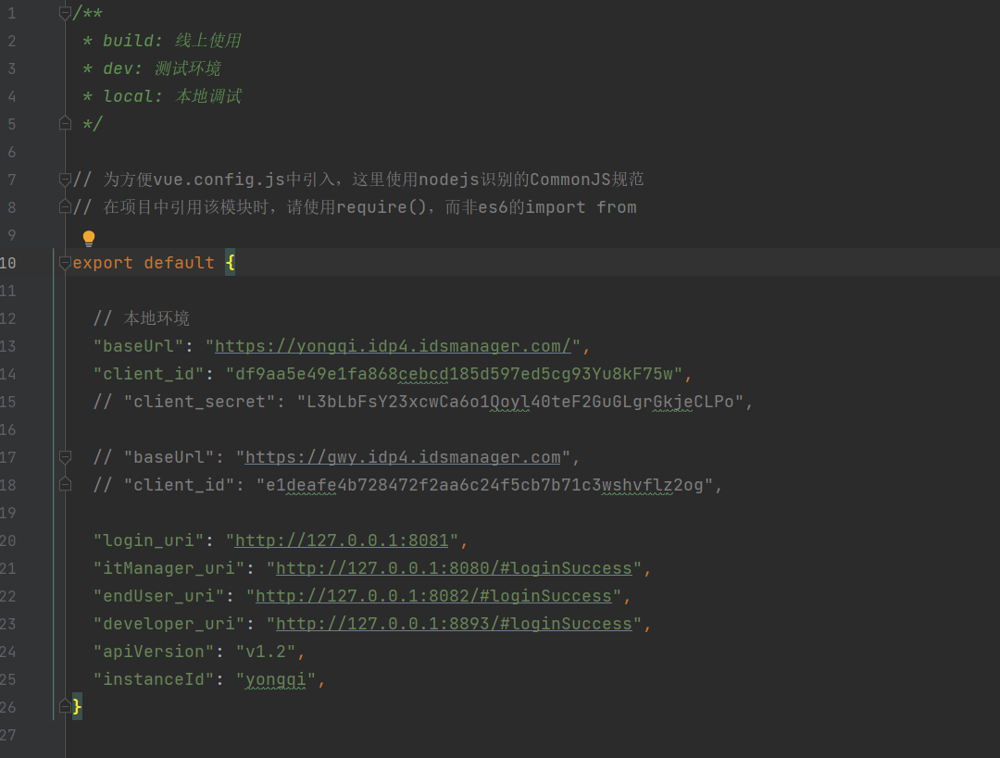
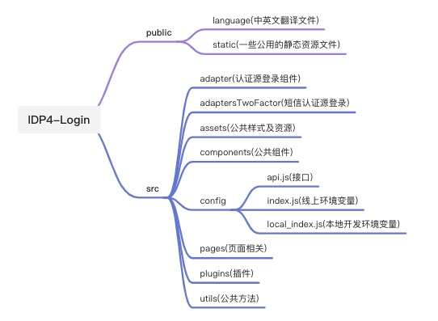
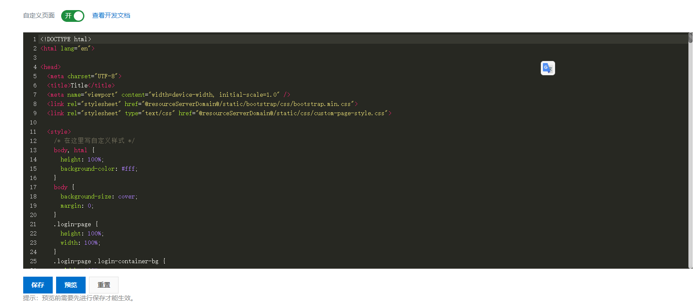
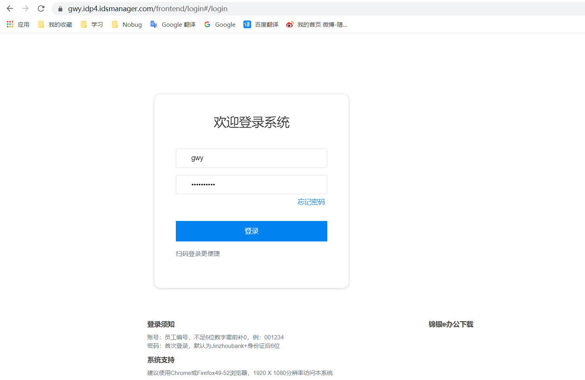
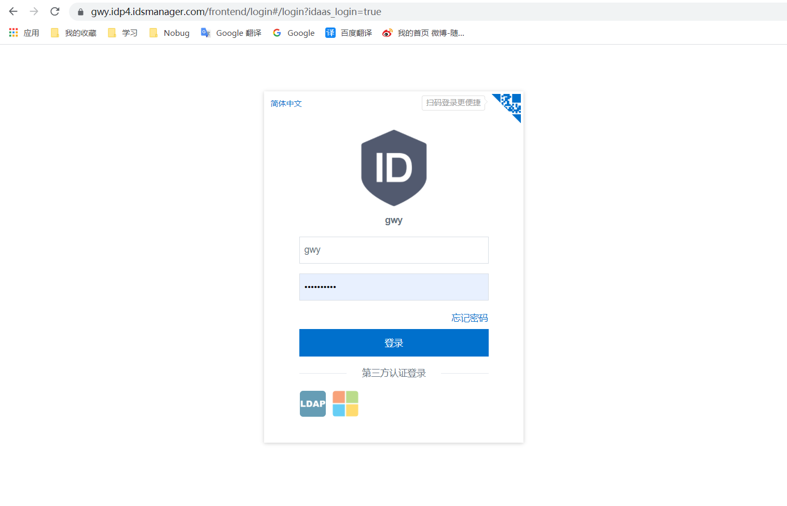
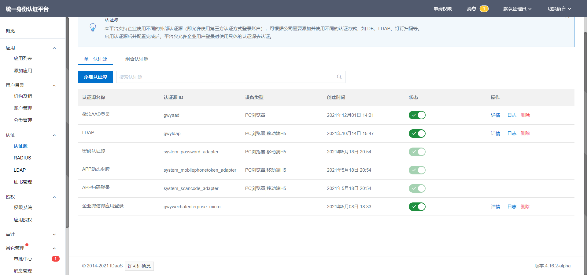
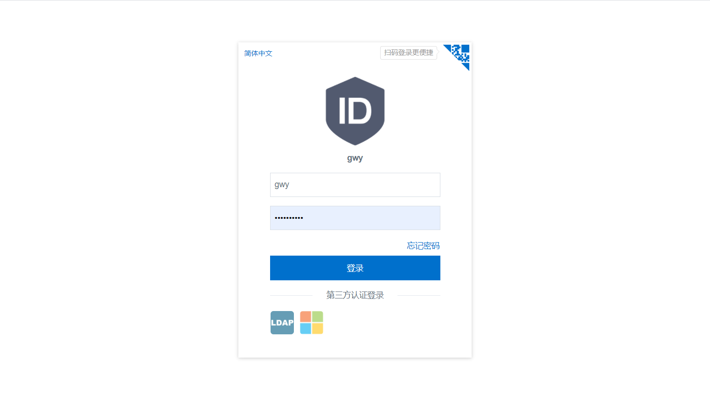

# 用户登录模块开发指南

> 维护人：前端团队   
> 适用版本：IDP4   
> 最后更新时间：2021.12.01

# 介绍

IDP4前端用户登录模块，用户可以根据自己的需求去进行自定义门户开发，以满足不同的场景需求。

# 准备

### 1.仓库地址
[https://codeup.aliyun.com/idaas_wb/WB-IDP-Frontend/IDP4-Login.git](https://codeup.aliyun.com/idaas_wb/WB-IDP-Frontend/IDP4-Login.git)
​

### 2.环境和配置
（1）安装node和npm，可以使用nvm工具来安装和管理node版本：[nvm安装和使用教程](https://blog.csdn.net/qq_41866776/article/details/102664679)

（2）安装vscode，打开项目，执行 `npm install ` 安装依赖

（3）本地启动前，需要更改 `src/config/local_index.js` 文件中的配置，一般需要我们修改三个配置项：`baseUrl`  `client_id`  `instanceId`，一般在确定baseUrl以后，在网页上查看网页源代码，就可以看到相关的属性值，配置到本地即可：

（4）启动服务：`npm run serve`

（5）打包：`npm run build`   打包后的目录为 dist

### 3.项目结构

### 4.技术栈
| **名称** | **文档地址** | **描述** |
| --- | --- | --- |
| Vue-Cli | [https://cli.vuejs.org/](https://cli.vuejs.org/) | 脚手架 |
| Vue | [https://cn.vuejs.org/](https://cn.vuejs.org/) | 前端框架 |
| Vuex | [https://vuex.vuejs.org/zh/](https://vuex.vuejs.org/zh/) | 前端框架 |
| iview | [https://iviewui.com/docs/introduce](https://iviewui.com/docs/introduce) | 前端框架 |
| axios | [http://www.axios-js.com/zh-cn/](http://www.axios-js.com/zh-cn/) | http库 |

### 
### 5.主要功能介绍
#### 1.自定义登录
目前登录模块支持自定义登录功能，登录进去以后，在管理员模块中的设置/个性化设置/登录页设置中可以进行设置，一旦启用自定义登录后，
登录页的信息都以自定义页面内容为准，“公司信息”中的公司名称、LOGO 以及“安全设置”中的允许注册等将不再生效。
​

注意：

(1).如果在开启自定义登录以后遇到问题需要使用原来的登录页，在url后面加上参数?idaas_login=true即可;
​

自定义登录页：

原来的登录页：

(2)某些分支的idaas-custom-login.js存在IE浏览器的兼容问题，如果在自定义登录页遇到需要将es6的语法全改成es5的语法；
​

#### 2.第三方认证源登录

除了账密登录和扫码登录以外，还支持第三方认证登录，需要现在管理员-认证源中添加对应的认证源，并且设置为显示和启用状态以后，
在登录页即可看到；

#### 3. 登录插件

请参考文档[IDaaS登录插件集成文档](docs/IDaaS登录插件集成文档.md)。
​

## 开发规范

请参考文档[《开发规范》](resources/阿里巴巴IDaaS前端开发规范.pdf)。

